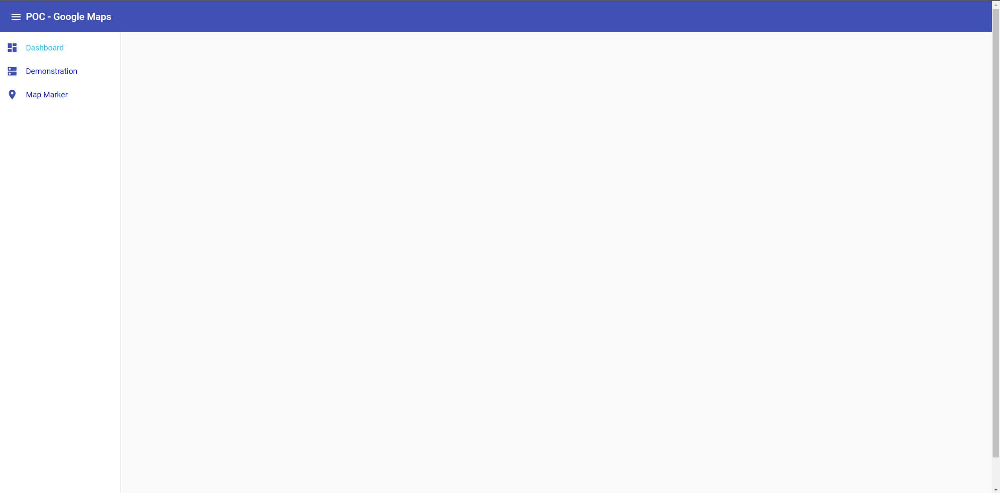
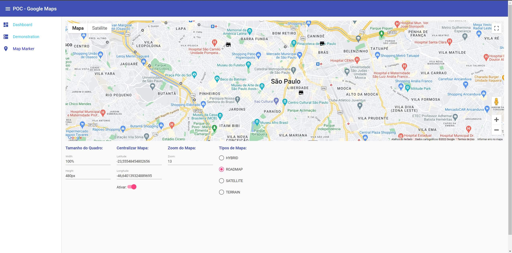

# POC - Google Maps

Essa prova de conceito foi desenvolvida para explorar as funcionalidades da API do **Google Maps**, ao longo da documentação teremos um breve descritivo da instalação e configuração, além de como executá-la e tirar o máximo proveito.

Segue um índice para acessar os principais tópicos:
* [Instalação](#instalacao) 
* [Configuração](#configuracao) 
* [Execução](#execucao) 
* [Referências](#referencias) 

##  Instalação
### @angular/google-maps
Para instalar execute o comando abaixo no terminal:
~~~npm
npm install @angular/google-maps
~~~

**Nota:** Lembre-se de definir a mesma versão do Angular que você estiver usando no projeto, caso contrário poderá dar conflito.

### @types/googlemaps
Outra instalação importante é a biblioteca responsável pela tipagem dos modelos e classes do **Google Maps**:

~~~~npm
npm install @types/googlemaps --save-dev
~~~~

&nbsp;
##  Configuração
Boa parte da configuração é explicada na própria documentação do [Google Maps](https://github.com/angular/components/tree/main/src/google-maps), mas ao decorrer do desenvolvimento foi necessário configurar os **types** no arquivo *tsconfig.app.json* da pasta **apps**.

**Acesse apps/nome-do-projeto/tsconfig.app.json e adicione a configuração abaixo:**
~~~~json
"compilerOptions": {
    ...,
    "types": [
         "googlemaps"
    ],
    ...,
},
~~~~

Provavelmente seu arquivo ficará semelhante ao **json** abaixo:
~~~~json
{
  "extends": "./tsconfig.json",
  "compilerOptions": {
    "outDir": "../../dist/out-tsc",
    "types": [
      "googlemaps"
    ]
  },
  "files": [
    "src/main.ts",
    "src/polyfills.ts"
  ]
}
~~~~

Outro arquivo que necessita de uma atenção previa é o *default-setting.const.ts* da pasta **models**, nesse arquivo você precisará definir algumas configurações padrões, mas o mais importante é definir a **chave** do projeto que foi gerada no **Google Clouds**.

~~~~ts
export const APPLICATION_NAME = 'POC - Google Maps';
export const KEY_API_GOOGLE_MAPS = 'AIzasfArrOhUnFsfsfwwV1yCmXgnXfwFsf1WvcwM-ME';
export const DEFAULT_ICON = './../../assets/store.svg';
export const LABEL_ORIGIN = { x: 10, y: 35 } as google.maps.Point;
~~~~

**Nota:** Lembre-se, sem essa chave a **API** do **Google Maps** não funcionará.

&nbsp;
##  Execução
A execução do projeto é bem simples, bastar usar o comando abaixo no terminal:

~~~npm
npm start
~~~
Ou se preferir:
~~~a
ng server
~~~

### Visualizando a Aplicação:

Após a execução do projeto acesse a **URL** padrão do Angular (http://localhost:4200), ao carregar a página inicial você verá a tela do **Dashboard** da aplicação:

Acessando o menu lateral você terá acesso aos módulos da aplicação, clique em **Demonstration** para visualizar a primeira tela de exemplo da API do **Google Maps**:

&nbsp;
##  Referências
Nesse projeto estamos usando a biblioteca do **Google** para componentes Angular, com base nesse ponto usei a própria documentação estabelecida no **GitHub**, segue os principais tópicos:

### Github:
* [Google Maps](https://github.com/angular/components/tree/main/src/google-maps)
* [Google Map](https://github.com/angular/components/tree/main/src/google-maps/google-map)
* [Map Marker](https://github.com/angular/components/tree/main/src/google-maps/map-marker)

### Developers Google:
Segue a também a documentação oficial do **Google Maps**:

* [Google Maps](https://developers.google.com/maps/documentation)
* [Primeiros Passos](https://developers.google.com/maps/get-started)
* [Classe/google.maps.Map](https://developers.google.com/maps/documentation/javascript/reference/map#MapOptions)
* [Markers Icons](https://developers.google.com/maps/documentation/javascript/examples/icon-simple)
